# Laboratorio 6

# DevOps Moderno con GitHub Actions y Azure

**Sistemas Operativos**  
**Matteo Cianelli**  
**18/06/2026**

---

## 1. Introducción

En este laboratorio se implementó un flujo básico de DevOps utilizando GitHub Actions como herramienta de integración y despliegue continuo. El objetivo fue crear una aplicación web simple, versionarla en GitHub, ejecutar una validación automática y desplegarla en una máquina virtual Ubuntu alojada en Azure.

Para el desarrollo se utilizó una aplicación web estática con Nginx. La página muestra el mensaje “Hola Mundo DevOps” y luego fue modificada para comprobar que un nuevo `push` al repositorio ejecutaba nuevamente el pipeline y actualizaba el contenido publicado. De esta forma, se pudo comprobar el ciclo completo de CI/CD: cambio en el código, ejecución automática, empaquetado, conexión por SSH, despliegue en la VM y validación pública del servicio.

La URL pública utilizada para la verificación fue:

```text
http://68.211.178.175
```

---

## 2. Investigación previa

### 2.1 DevOps

DevOps es una forma de trabajo que busca integrar el desarrollo de software con las operaciones de infraestructura. Su objetivo es reducir la separación entre quienes desarrollan una aplicación y quienes la despliegan o mantienen en producción. Para lograrlo, utiliza automatización, control de versiones, pruebas continuas, integración continua y despliegue continuo.

En este laboratorio, la práctica DevOps se aplicó al automatizar el proceso de despliegue de una página web desde GitHub hacia una VM en Azure.

### 2.2 Integración continua

La integración continua, o CI, consiste en validar automáticamente los cambios realizados en el código cada vez que se suben al repositorio. Esto permite detectar errores de forma temprana antes de que lleguen al ambiente de despliegue.

En este caso, la integración continua se realizó mediante un job de GitHub Actions que descargó el código, ejecutó pruebas básicas, empaquetó la aplicación y publicó un artifact.

### 2.3 Despliegue continuo

El despliegue continuo, o CD, consiste en automatizar la publicación de una aplicación en un ambiente determinado. En este laboratorio, el despliegue continuo se realizó luego de que el job de CI finalizara correctamente. El pipeline se conectó por SSH a la VM Ubuntu, copió el paquete generado y actualizó los archivos servidos por Nginx.

### 2.4 Pipeline

Un pipeline es una secuencia automatizada de pasos que se ejecutan para construir, probar, empaquetar y desplegar una aplicación. En este caso, el pipeline se definió en el archivo `ci-cd.yml` dentro de la carpeta `.github/workflows`.

El pipeline quedó dividido en dos jobs principales:

- Integración continua.
- Despliegue continuo.

### 2.5 YAML

YAML es un formato de texto utilizado para definir configuraciones de manera legible. GitHub Actions utiliza archivos YAML para describir los eventos que disparan un workflow, los jobs, los steps y los comandos que deben ejecutarse.

En este laboratorio se utilizó YAML para configurar el workflow de CI/CD.

### 2.6 Runner

Un runner es el entorno donde GitHub Actions ejecuta los jobs definidos en el workflow. En este caso se utilizó `ubuntu-latest`, por lo que los comandos del pipeline se ejecutaron sobre un entorno Linux provisto por GitHub.

### 2.7 Artifact

Un artifact es un archivo generado durante la ejecución de un pipeline y conservado como resultado del proceso. En este laboratorio, la aplicación fue empaquetada en un archivo `.tar.gz` y publicada como artifact. Luego, el job de despliegue descargó ese artifact para copiarlo a la VM.

### 2.8 SSH

SSH es un protocolo que permite conectarse de forma segura a un servidor remoto mediante una terminal. En este laboratorio se utilizó SSH para administrar la VM Ubuntu y también para que GitHub Actions pudiera conectarse automáticamente al servidor durante el despliegue.

### 2.9 Secrets

Los secrets son valores sensibles guardados de forma segura en GitHub. Se utilizan para evitar exponer claves, usuarios, direcciones o credenciales dentro del código fuente. En este laboratorio se usaron secrets para guardar la IP de la VM, el usuario de conexión y la clave privada SSH utilizada por el pipeline.

---

## 3. Desarrollo

### 3.1 Creación del repositorio y estructura del proyecto

Primero se creó el repositorio `lab06-devops` en GitHub. Luego se preparó la estructura del proyecto con las carpetas necesarias para separar el código de la aplicación, los scripts, el workflow y las evidencias del laboratorio.

La estructura utilizada fue la siguiente:

```text
lab06-devops/
├── .github/
│   └── workflows/
├── app/
├── evidencias/
├── pipeline/
├── scripts/
└── README.md
```

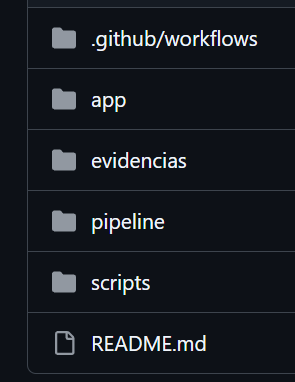

También se verificó la estructura desde Visual Studio Code.

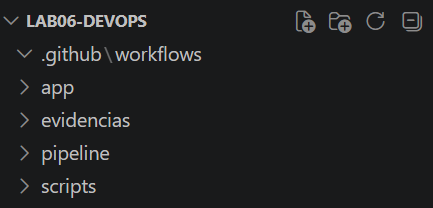

### 3.2 Creación de la aplicación web

Se creó una aplicación web estática dentro de la carpeta `app`. El archivo principal fue `index.html`, con un contenido simple para mostrar el mensaje del laboratorio.

El contenido principal de la página fue:

```html
<h1>Hola Mundo DevOps</h1>
<p>Aplicación desplegada automáticamente con GitHub Actions en Azure.</p>
```

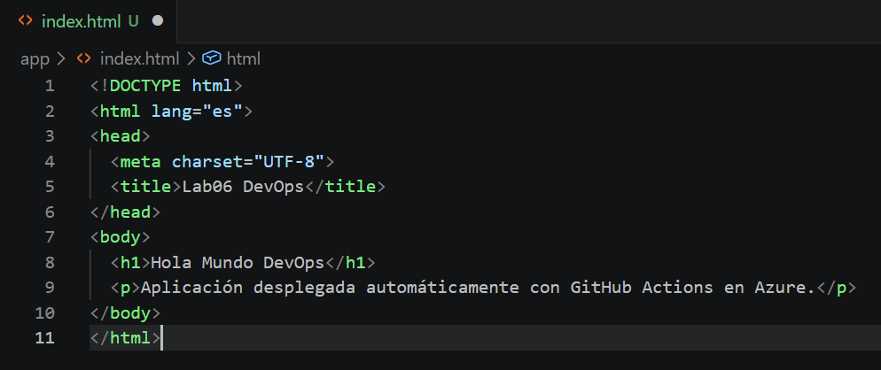

### 3.3 Pruebas locales

Para validar la aplicación se creó un script llamado `test.sh` dentro de la carpeta `scripts`. Este script verifica que exista el archivo `app/index.html` y que contenga el texto esperado.

El script se ejecutó localmente antes de subir los cambios al repositorio. La salida confirmó que la validación terminó correctamente.

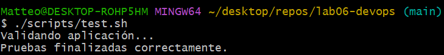

### 3.4 Creación de la máquina virtual en Azure

Luego se creó una máquina virtual en Azure para utilizarla como ambiente de despliegue. La VM fue configurada con Ubuntu Server 24.04 LTS, arquitectura x64, autenticación mediante clave pública SSH y un tamaño pequeño suficiente para el laboratorio.

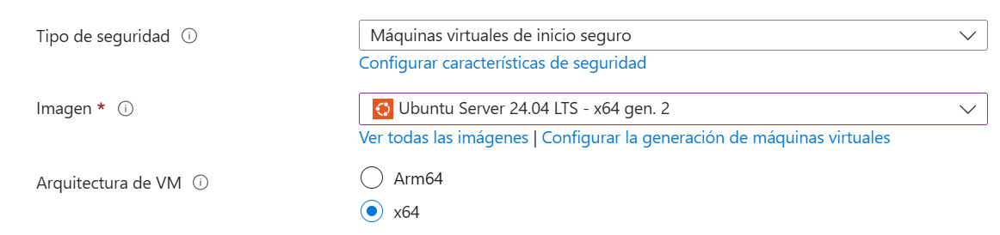

El tamaño seleccionado fue `Standard_B2ats_v2`, con 2 vCPU y 1 GiB de memoria.

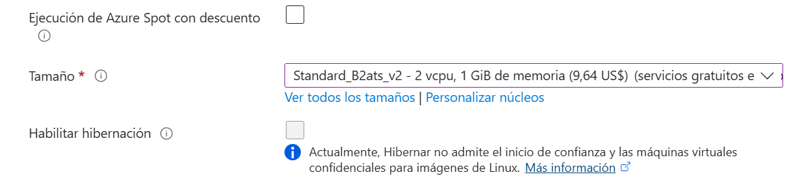

También se configuraron los puertos de entrada necesarios. Se habilitó SSH en el puerto 22 para administrar la máquina y HTTP en el puerto 80 para acceder a la página web desde el navegador.

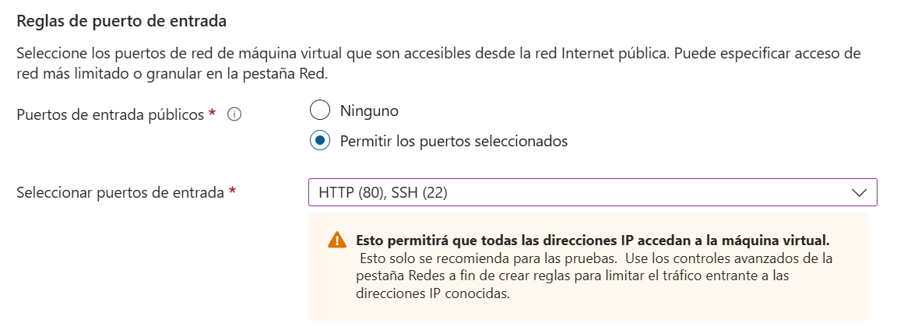

### 3.5 Conexión SSH a la VM

Una vez creada la máquina virtual, se realizó la conexión SSH desde la terminal utilizando la clave privada generada por Azure. Al conectarse, se verificó que el sistema operativo era Ubuntu 24.04.4 LTS.

Durante la prueba se ejecutó inicialmente un comando escrito incorrectamente, pero luego se corrigió con `lsb_release -a`, obteniendo la información correcta del sistema.

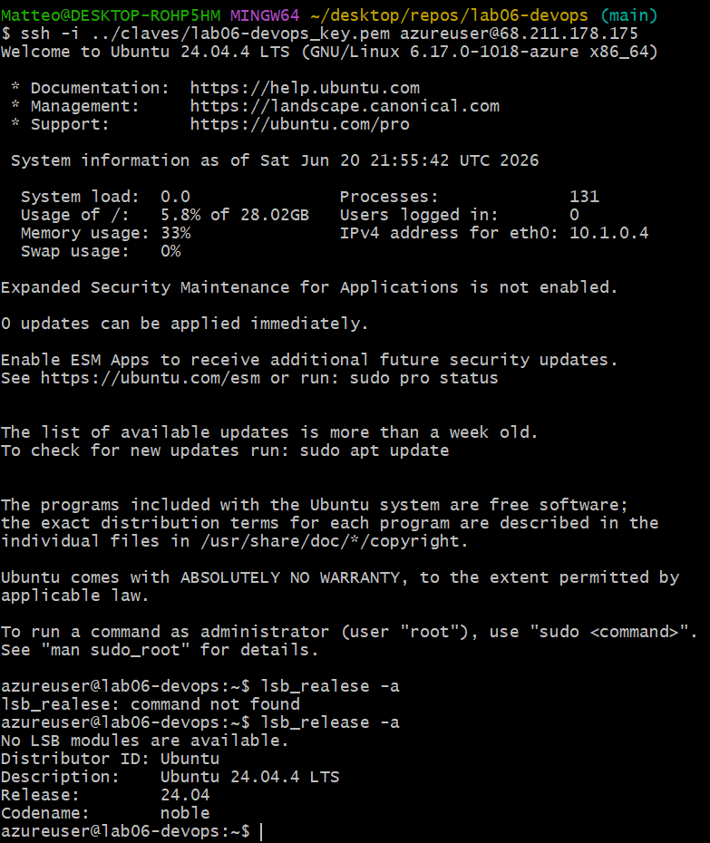

### 3.6 Instalación y verificación de Nginx

Dentro de la VM se instaló Nginx para servir la aplicación web. Luego se verificó el estado del servicio mediante `systemctl`.

La salida mostró que el servicio `nginx` estaba activo y en ejecución.

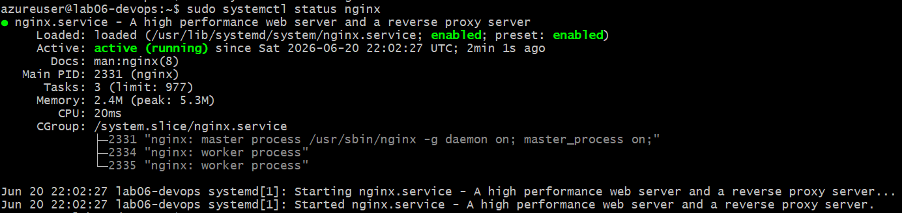

También se accedió desde el navegador a la IP pública de la VM y se confirmó que la página por defecto de Nginx estaba funcionando.

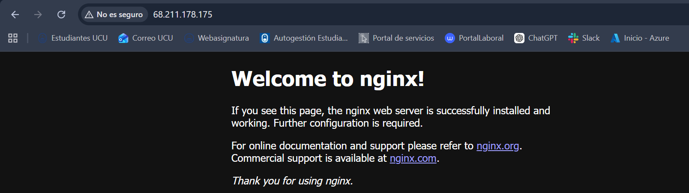

Antes del despliegue automático se realizó una prueba manual escribiendo un contenido simple en `/var/www/html/index.html` y validándolo con `curl http://localhost`.

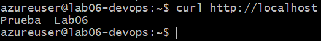

### 3.7 Configuración de clave SSH para GitHub Actions

Para que GitHub Actions pudiera conectarse a la VM sin intervención manual, se creó una clave SSH específica para el pipeline. La clave pública se agregó al archivo `authorized_keys` de la VM y luego se probó la conexión desde la máquina local usando la nueva clave.

La conexión fue exitosa, lo que confirmó que GitHub Actions podría usar esa credencial para conectarse al servidor.

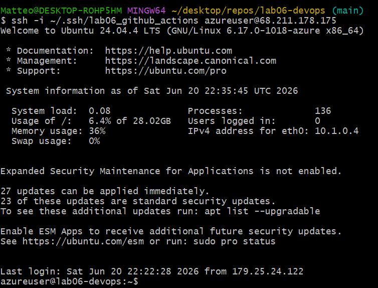

### 3.8 Configuración de secrets en GitHub

Después se crearon los secrets del repositorio en GitHub. Se agregaron tres valores:

```text
AZURE_VM_HOST
AZURE_VM_SSH_KEY
AZURE_VM_USER
```

Estos datos permiten que el workflow use la IP pública de la VM, el usuario de Ubuntu y la clave privada SSH sin dejarlos escritos directamente en el repositorio.

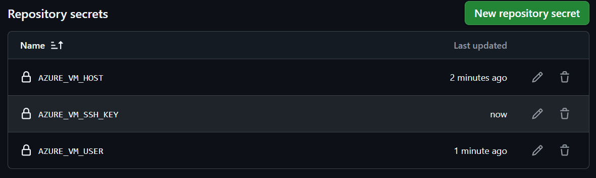

### 3.9 Configuración del workflow de GitHub Actions

El pipeline se definió en el archivo:

```text
.github/workflows/ci-cd.yml
```

El workflow se configuró para ejecutarse ante eventos `push`, `pull_request` y también manualmente mediante `workflow_dispatch`.

El job de integración continua realiza las siguientes acciones:

1. Descarga el código del repositorio.
2. Ejecuta las pruebas básicas.
3. Empaqueta la aplicación en un archivo `.tar.gz`.
4. Publica el paquete como artifact.

El job de despliegue continuo realiza las siguientes acciones:

1. Descarga el artifact generado por el job anterior.
2. Configura la clave SSH a partir de los secrets.
3. Copia el paquete a la VM.
4. Descomprime y copia los archivos a `/var/www/html`.
5. Recarga Nginx.
6. Valida la URL pública.

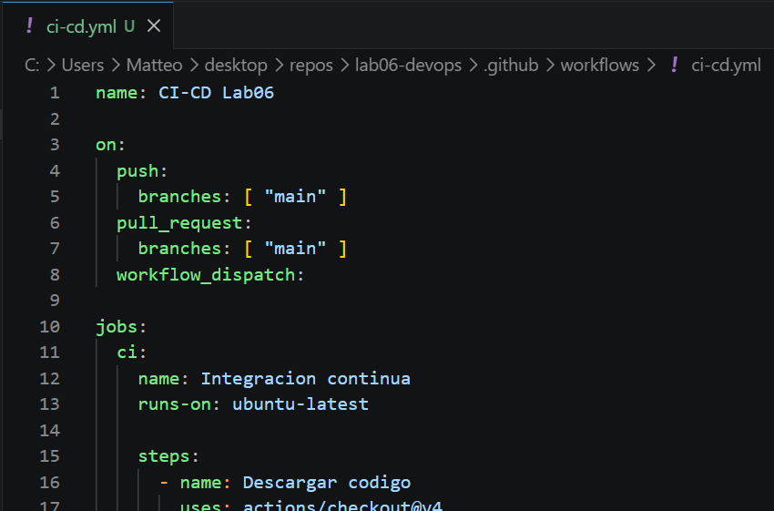

### 3.10 Subida de cambios al repositorio

Luego de crear el workflow, se subieron los cambios al repositorio mediante `git push origin main`.

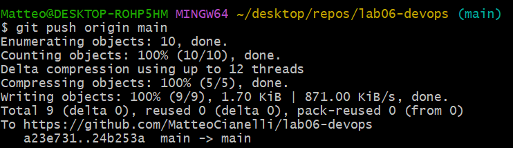

### 3.11 Ejecución del pipeline

Al realizar el `push`, GitHub Actions ejecutó automáticamente el workflow. La ejecución finalizó correctamente, mostrando los dos jobs en estado exitoso: integración continua y despliegue continuo.

También se generó un artifact, lo que confirma que el empaquetado de la aplicación fue realizado correctamente.

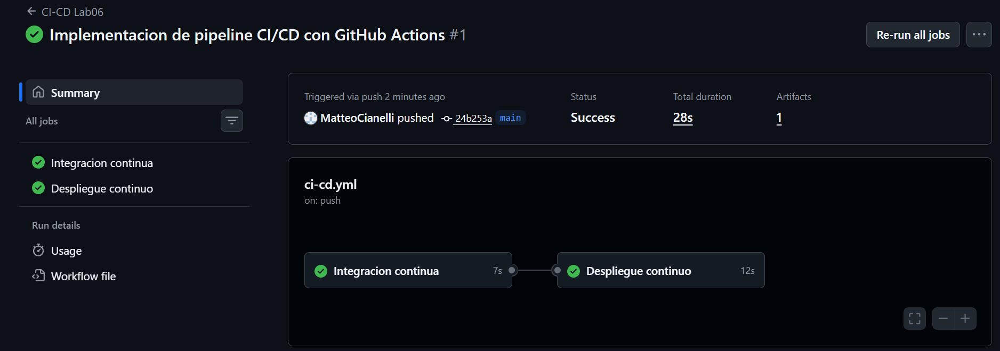

En el job de integración continua se puede observar que se ejecutaron correctamente los pasos de descarga del código, pruebas, empaquetado y publicación del artifact.

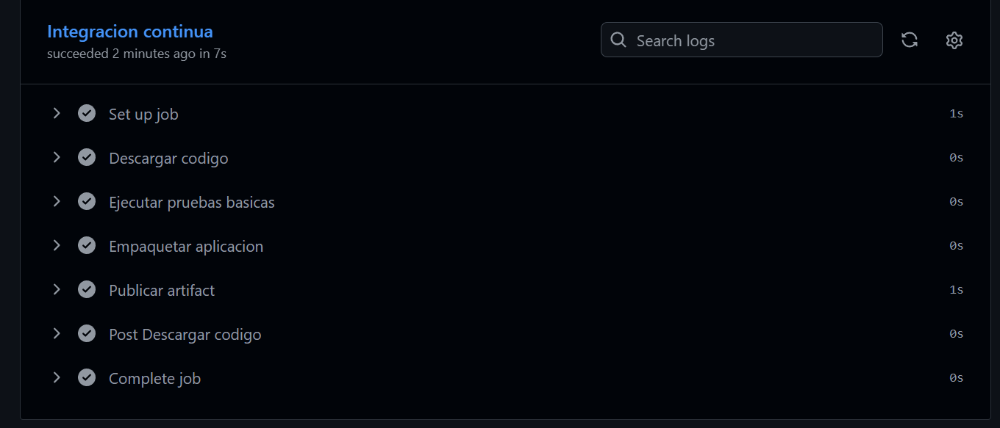

En el job de despliegue continuo se puede observar la descarga del artifact, la configuración de la clave SSH, la copia del paquete a la VM, el despliegue en la VM y la validación de la URL pública.

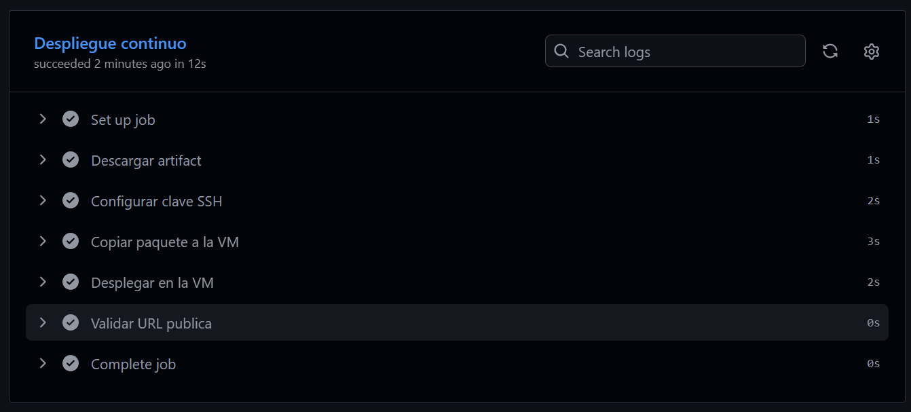

### 3.12 Verificación de la aplicación desplegada

Luego del pipeline exitoso, se accedió a la IP pública de la VM desde el navegador. La página mostró el mensaje configurado en `index.html`, confirmando que la aplicación fue desplegada correctamente.

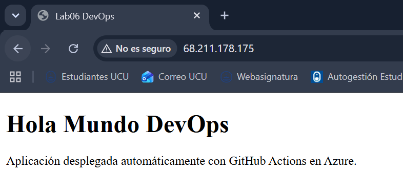

### 3.13 Segundo despliegue automático

Para comprobar que el despliegue era realmente automático, se modificó el contenido de la página y se realizó un nuevo `push` al repositorio. Esto disparó una segunda ejecución del pipeline.

La segunda ejecución también finalizó correctamente.

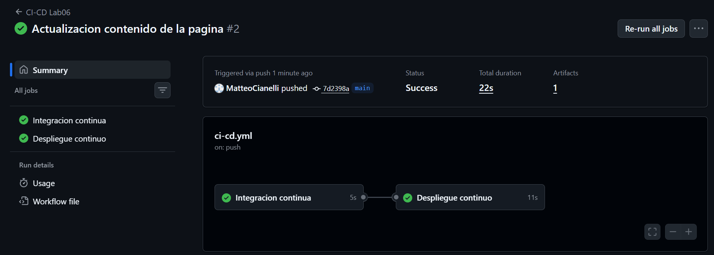

Luego se volvió a ingresar a la IP pública de la VM y se observó que el contenido había sido actualizado. Esto confirmó que los cambios del repositorio se desplegaron automáticamente en el servidor.

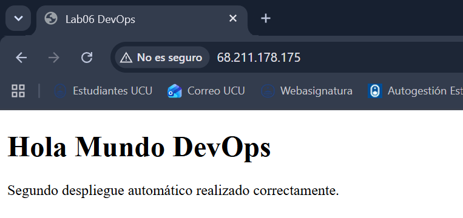

---

## 4. Problemas encontrados y soluciones

### 4.1 Diferencia entre terminales

Al inicio hubo confusión entre comandos de Linux y comandos de Windows. Algunos comandos como `mkdir -p` no funcionan en CMD, pero sí funcionan en Git Bash, WSL o una terminal Linux.

La solución fue trabajar con Git Bash y utilizar rutas compatibles con ese entorno.

### 4.2 Repositorio vacío en GitHub

Luego de crear las carpetas del proyecto, el repositorio aparecía vacío en GitHub. Esto ocurrió porque Git no registra carpetas vacías y porque todavía no se habían agregado archivos mediante commit y push.

La solución fue crear archivos reales dentro del proyecto, como `index.html`, `test.sh` y `ci-cd.yml`, y luego ejecutar:

```bash
git add .
git commit -m "Implementacion de pipeline CI/CD con GitHub Actions"
git push origin main
```

### 4.3 Conexión SSH a la VM

Al intentar conectarse inicialmente a la VM apareció el error `Permission denied (publickey)`. Esto indicaba que la máquina virtual requería una clave SSH válida y que el comando no estaba usando la clave correcta.

La solución fue utilizar el parámetro `-i` para indicar la ruta de la clave privada:

```bash
ssh -i ../claves/lab06-devops_key.pem azureuser@68.211.178.175
```

### 4.4 Configuración de la clave para GitHub Actions

Otro punto importante fue permitir que GitHub Actions también pudiera conectarse por SSH. Para eso se creó una clave específica, se agregó su clave pública a `authorized_keys` en la VM y se guardó la clave privada como secret en GitHub.

De esta forma, el pipeline puede conectarse sin exponer credenciales en el repositorio.

### 4.5 Permisos y despliegue en Nginx

Para poder copiar los archivos de la aplicación a la carpeta servida por Nginx, fue necesario ajustar permisos sobre `/var/www/html` y usar un proceso de despliegue que copiara el contenido del artifact hacia esa ruta.

El workflow realiza esta tarea automáticamente usando `rsync` y luego recarga Nginx.

---

## 5. Reflexión técnica

### 5.1 ¿Qué ocurre si falla la integración continua?

Si falla el job de integración continua, el job de despliegue continuo no se ejecuta. Esto es importante porque evita publicar una versión que no pasó las validaciones mínimas. En este laboratorio, el job de CD depende del job de CI mediante la instrucción `needs: ci`.

### 5.2 ¿Por qué se usan secrets?

Los secrets se utilizan para proteger información sensible, como claves privadas SSH, usuarios o direcciones de servidores. Si estos datos se escribieran directamente en el archivo YAML, quedarían expuestos en el repositorio.

En este laboratorio se usaron secrets para guardar la información necesaria para conectarse a la VM sin comprometer la seguridad del proyecto.

### 5.3 ¿Qué ventaja tiene usar artifacts?

El artifact permite separar la etapa de construcción o empaquetado de la etapa de despliegue. El job de CI genera un paquete con la aplicación y el job de CD utiliza exactamente ese paquete para desplegar. Esto mejora la trazabilidad, porque se sabe qué versión fue generada y desplegada.

### 5.4 ¿Qué diferencia hay entre un despliegue manual y uno automatizado?

En un despliegue manual, el usuario debe conectarse al servidor y copiar los archivos por su cuenta. Esto puede generar errores, olvidos o diferencias entre ejecuciones.

En un despliegue automatizado, el procedimiento queda definido en el pipeline y se repite siempre de la misma manera. En este caso, cada `push` a la rama `main` ejecuta el flujo completo y actualiza la aplicación en la VM.

### 5.5 ¿Cómo podría mejorarse este pipeline?

El pipeline podría mejorarse agregando pruebas más completas, una etapa de rollback, validaciones HTML más estrictas o un entorno separado de staging antes de desplegar a producción. También se podría utilizar Docker para empaquetar la aplicación como imagen, aunque para este laboratorio la opción de una aplicación estática con Nginx fue suficiente.

---

## 6. Conclusión

El laboratorio permitió implementar un flujo CI/CD funcional utilizando GitHub Actions y una máquina virtual Ubuntu en Azure. Se creó una aplicación web simple, se configuró un workflow automático, se publicaron artifacts y se desplegó el contenido en un servidor Nginx mediante SSH.

El resultado final demuestra que el proceso de despliegue quedó automatizado: al modificar el archivo `index.html` y subir el cambio al repositorio, GitHub Actions ejecutó nuevamente el pipeline y actualizó la página publicada en la IP de la VM.

También se reforzaron conceptos importantes como DevOps, integración continua, despliegue continuo, uso de runners, artifacts, claves SSH y secrets. En general, el laboratorio muestra cómo automatizar tareas que normalmente se harían manualmente, reduciendo errores y haciendo el despliegue más reproducible.

---

## 7. Lista de evidencias

| Nº | Archivo | Descripción |
|---:|---|---|
| 1 | `01.png` | Repositorio en GitHub con estructura inicial |
| 2 | `02.png` | Estructura del proyecto en Visual Studio Code |
| 3 | `03.png` | Archivo `index.html` de la aplicación |
| 4 | `04.png` | Ejecución local del script de pruebas |
| 5 | `05.png` | Selección de Ubuntu Server 24.04 LTS en Azure |
| 6 | `06.png` | Tamaño de la máquina virtual |
| 7 | `07.png` | Puertos HTTP 80 y SSH 22 habilitados |
| 8 | `08.png` | Conexión SSH y verificación de Ubuntu |
| 9 | `09.png` | Servicio Nginx activo |
| 10 | `10.png` | Página inicial de Nginx desde navegador |
| 11 | `11.png` | Prueba local con `curl` |
| 12 | `12.png` | Conexión usando clave SSH para GitHub Actions |
| 13 | `13.png` | Secrets configurados en el repositorio |
| 14 | `14.png` | Archivo `ci-cd.yml` |
| 15 | `15.png` | Subida de cambios con `git push` |
| 16 | `16.png` | Pipeline completo ejecutado correctamente |
| 17 | `17.png` | Job de integración continua exitoso |
| 18 | `18.png` | Job de despliegue continuo exitoso |
| 19 | `19.png` | Aplicación publicada en la IP de la VM |
| 20 | `20.png` | Segundo pipeline exitoso |
| 21 | `21.png` | Aplicación actualizada luego del segundo despliegue |
